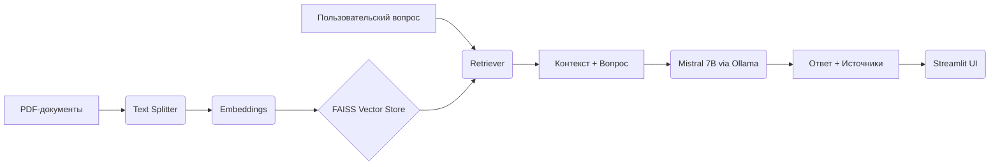
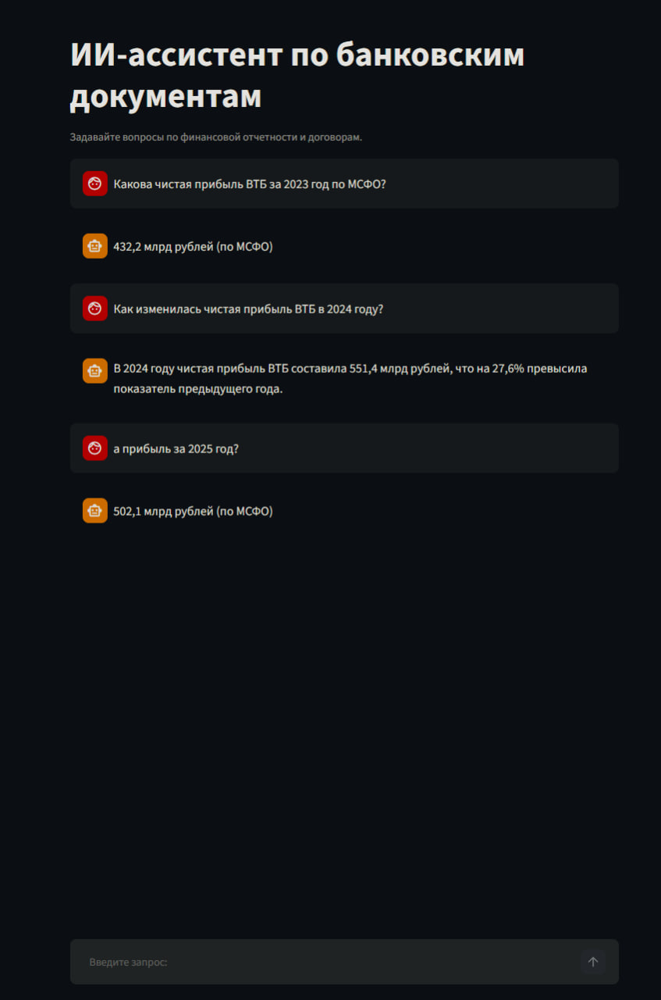

# RAG-система для анализа банковских документов

Retrieval-Augmented Generation (RAG) система для работы с финансовой отчётностью и кредитными договорами. Проект демонстрирует навыки интеграции локальных LLM (Mistral через Ollama) с векторными базами данных (FAISS) для извлечения информации из неструктурированных документов.

---

## Цель проекта

Создать локальный сервис, который отвечает на вопросы по банковским документам (отчёты МСФО, договоры) с обязательным указанием источника. Это критически важно для банковского сектора, где данные не могут покидать контур организации.

---

## Технологический стек
- **Язык:** Python 3.12.5
- **Фреймворки:** LangChain, Streamlit
- **Векторная БД:** FAISS
- **Эмбеддинги:** `sentence-transformers/paraphrase-multilingual-MiniLM-L12-v2`
- **LLM:** Mistral 7B (локально через Ollama)
- **Инфраструктура:** Git, .env

---

## Особенности

- **Гибридный поиск (BM25 + FAISS)** — объединяет точное совпадение по ключевым словам и семантическую близость, что повышает точность на коротких и уточняющих запросах.
- **История диалога** — система помнит последние 5 оборотов, позволяя задавать уточняющие вопросы без повторения контекста (например, "а за 2024 год?").
- **Расширение запросов** — автоматически дополняет короткие вопросы ключевыми словами из предыдущего диалога (например, "прибыль за 2024?").
- **Фильтрация по году** — поиск ограничивается документами нужного года (если год указан в вопросе).
- **Локальное развёртывание** — вся обработка происходит на вашем компьютере через Ollama, данные не покидают вашу систему.

---

## ⚙️ Как работает поиск

1. При поступлении вопроса система анализирует историю диалога. Если вопрос является уточнением (содержит только год или короткую фразу), он расширяется ключевыми словами из предыдущего вопроса.
2. Выполняется гибридный поиск:
   - **FAISS** находит семантически близкие чанки.
   - **BM25** находит чанки с точным совпадением ключевых слов.
3. Результаты объединяются без дубликатов, и топ-3 чанка передаются в LLM для генерации ответа.
4. Ответ сохраняется в историю, позволяя вести многошаговый диалог.

---

## Архитектура


---

## Установка и запуск

### Предварительные требования
1. Наличие Python (версии хотя бы 3.10)
2. Установленная Ollama и модель mistral

### 1. Клонирование repo
```bash
git clone https://github.com/AnimeTano/RAG-in-Bank
cd RAG-in-Bank
```

### 2. Настройка окружения
```bash
python -m venv venv
venv\Scripts\activate #(или иная версия в зависимости от системы, названия окружения)
pip install -r requirements.txt
```

### 3. Загрузка модели mistral
Для этого необходимо иметь на диске свободное место (~5 ГБ)
```bash
ollama pull mistral
```

### 4. Построение векторного индекса

Поместите PDF-файлы в папку `data/raw` (Можно использовать, например: [Годовые отчеты ВТБ](https://www.vtb.ru/ir/statements/annual/))

После этого необходимо выполнить следующий код:
```bash
python src/build_vectorstore.py
```

### 5. Запуск Streamlit-интерфейса
```bash
streamlit run app/streamlit_app.py
```

---

## Демонстрация 



---

## 📊 Оценка качества

Система протестирована на наборе из N вопросов по банковской отчётности.  
Метрики поиска (Retrieval) на топ-5 чанков:

| Метрика | Значение |
|---------|----------|
| Precision@1 | 0.429 |
| Precision@3 | 0.357 |
| Precision@5 | 0.271 |
| MRR | 0.500 |

*Метрики рассчитаны с использованием фильтрации по году и пост-обработки.

*Примечание:* Проведён эксперимент с гибридным поиском (FAISS + BM25), но он не улучшил метрики, поэтому в финальной версии используется только FAISS с фильтрацией по году и расширением запросов.

### Воспроизводимость оценок

Для воспроизводимости запустите файл `metrics`, отчет будет сохранен в `evaluation/report.json`