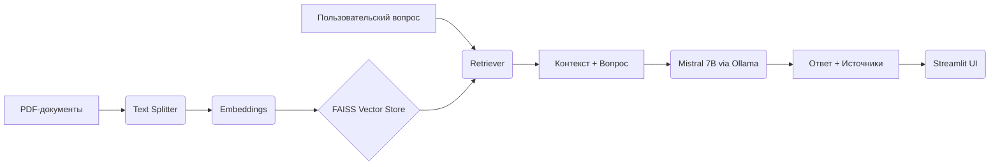

# RAG-система для анализа банковских документов

Retrieval-Augmented Generation (RAG) система для работы с финансовой отчётностью и кредитными договорами. Проект демонстрирует навыки интеграции локальных LLM (Mistral через Ollama) с векторными базами данных (FAISS) для извлечения информации из неструктурированных документов.

---

## Цель проекта

Создать локальный сервис, который отвечает на вопросы по банковским документам (отчёты МСФО, договоры) с обязательным указанием источника. Это критически важно для банковского сектора, где данные не могут покидать контур организации.

---

## Технологический стек
- **Язык:** Python 3.12.5
- **Фреймворки:** LangChain, Streamlit
- **Векторная БД:** FAISS
- **Эмбеддинги:** `sentence-transformers/paraphrase-multilingual-MiniLM-L12-v2`
- **LLM:** Mistral 7B (локально через Ollama)
- **Инфраструктура:** Git, .env

---

## Архитектура


---

## Установка и запуск

### Предварительные требования
1. Наличие Python (версии хотя бы 3.10)
2. Установленная Ollama и модель mistral

### 1. Клонирование repo
```bash
git clone https://github.com/AnimeTano/RAG-in-Bank
cd RAG-in-Bank
```

### 2. Настройка окружения
```bash
python -m venv venv
venv\Scripts\activate #(или иная версия в зависимости от системы, названия окружения)
pip install -r requirements.txt
```

### 3. Загрузка модели mistral
Для этого необходимо иметь на диске свободное место (~5 ГБ)
```bash
ollama pull mistral
```

### 4. Построение векторного индекса

Поместите PDF-файлы в папку `data/raw` (Можно использовать, например: [Годовые отчеты ВТБ](https://www.vtb.ru/ir/statements/annual/))

После этого необходимо выполнить следующий код:
```bash
python src/build_vectorstore.py
```

### 5. Запуск Streamlit-интерфейса
```bash
streamlit run app/streamlit_app.py
```

---

## Демонстрация 

(Добавлю позже)

---